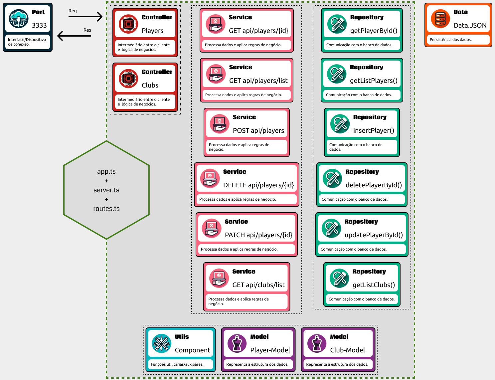

# ⚽ Recriando a API da Champions League  com Node.js e Express



## 🚀 Objetivo

Criar um sistema que alimenta o campeonato de futebol mais prestigiado da Europa, utilizando Node.js e Express, com suporte total a TypeScript; Fornecendo uma estrutura escalável, com boas práticas de programação, organização de código em camadas e um design limpo.

## 🛠 Tecnologias Utilizadas

- TypeScript;
- Express;
- Cors;

## 📚 Funcionalidades

📃 Rotas organizadas para diferentes recursos (clubes, jogadores, etc.).
🔒 Validação de dados e regras de negócio através da camada de serviço.
💾 Acesso simples ao banco de dados.

## 🚧 Estrutura do Projeto

```bash
/src
├── /controllers       # Controladores que processam as requisições HTTP
├── /data              # Arquivos JSON (fontes de dados)
├── /models            # Interfaces e tipos TypeScript
├── /repositories      # Acesso ao banco de dados (JSON)
├── /services          # Regras de negócio e lógica da aplicação
├── /utils             # Funções auxiliares e utilitários
├── app.ts             # Criação e configuração do aplicativo Express (createApp)
├── route.ts           # Definição de rotas e middlewares (router)
└── server.ts          # Inicialização do servidor (app.listen)
```

## 📋 Metodologia

1. Criação de rota (`route.ts`).
    1. As rotas são os pontos de entrada para os recursos da API, responsáveis por receber as requisições HTTP e redirecioná-las aos controladores apropriados.
2. Criação da função no controller (`-controller.ts`).
    1. O controlador processa a requisição, extrai os parâmetros necessários e os repassa para a camada de serviço.
3. Criação da função no service (`-service.ts`)
    1. A camada de serviço é onde residem as regras de negócio. Ela garante que a lógica da aplicação seja cumprida, além de fazer verificações e validações antes de acessar o banco de dados.
4. Criação da função no repository (`-repository.ts`).
    1. O repositório é responsável pela comunicação com o banco de dados, abstraindo as operações CRUD (Create, Read, Update, Delete).

## 📦 Execução Local

- Clonar o repositório (`git clone`)
- Instalar dependências (`cd` e `npm install`)
- Definir uma variável PORT em um arquivo `.env`
- Iniciar o servidor (`start:<dev|watch|dist>`)
